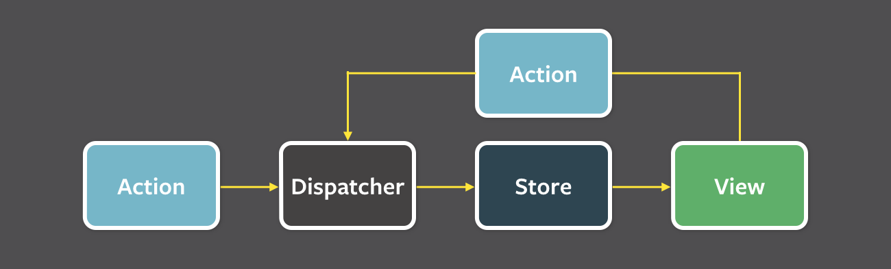
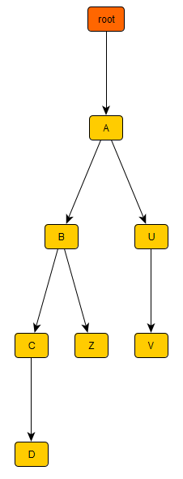
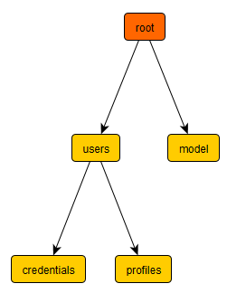
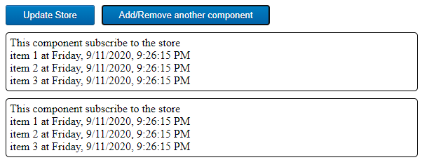

# React Flux pattern with RxJS 6

## What Flux is all about?

Here is the Flux pattern:



The goal is:

- To have a **shared state** between your widgets. Note that props are not designed for this.
- To **avoid coupling** between the one that change the shared state and those who consume the shared state
- To respect **unidirectional data flow**

There are actually two implementations of this architectural pattern

- The official Facebook Flux. Official site is [here](https://facebook.github.io/flux/).
- Redux, official site is [here](https://redux.js.org/).

The issue is the usual one with frameworks and API: 

- You have to learn them to understand your application code. What is an action? what is a dispatcher?...
- You will heavily depend on them at the point your project will be recognized as a "Flux project" or a "Redux project".
- Their objects will spread everywhere in your code. Actions everywhere. Dispatchers everywhere.

## RxJS to the rescue

This project demonstrate **how reactive programming is way more simple to implement a shared state** with loose coupling. I argue that learning RxJS is more valuable than learning Flux or Redux because it is a programming paradigm that you can leverage in other languages like Java. One single JavaScript file is enough to build you own event bus.

### The main idea

The share state is just a tree of objects hosted in a singleton called a store. Any modification on this tree will fire an event inside an event bus. We are going to build this event bus using an Rx [Observable](https://RxJS-dev.firebaseapp.com/guide/observable). You can subscribe to it and unsubscribe from it at any point in time.

The observable is like a stream of events. Each event is just a string saying "the property A.B.C.D in the shared state have changed".

The important point here is that we use **hot observables** instead of **cold observables**. In RxJS 6, They are called [ConnectableObservable](https://RxJS-dev.firebaseapp.com/api/operators/publish). 

- **Cold observables** are not designed to build an event bus, because you will read all events from the start.
- **Hot observables** is the perfect choice to build an event bus, because when to connect to it, you get the stream of events as it is now. You don't receive past events.

### How to subscribe to a subset of events

The beauty of Rx is that you can filter the stream of events before subscribing to it. This means you can decide to subscribe to a subset of events instead of all of them. This is done using the operator **filter**:

```javascript
observable.pipe(filter(event=>...select what you want...)).subscribe(subscriberCallBack)
```

In the class `GlobalStore` we used this technique in the method `subscribe`.

- `MyAppStore.subscribe("a.b.c",callback)`: react only on this specific node
- `MyAppStore.subscribe("a.*",callback)`: react to any change on node 'a' and below

### Don't forget to unsubscribe

In RxJS when you subscribe, you receive an object used to unsubscribe. So it is important to use this "handle" to avoid any memory leak:

- Subscribe when your component did mount
- Unsubscribe when your component will unmount

Example:

```javascript
    componentDidMount()
    {
        console.log("ItemsViewer::componentDidMount subscribe to store...");
        this.storeHandle = MyAppStore.subscribe("model",this.onModelUpdated);
    }

    componentWillUnmount()
    {
        console.log("ItemsViewer::componentWillUnmount unsubscribe from store...");
        if (this.storeHandle)
        {
            this.storeHandle.unsubscribe();
            this.storeHandle = null;
        }
    }
```


### Protect the shared state

It would be very dangerous to give a direct reference to the share state to the consumer. Remember we want to keep unidirectional data flow. Here some solutions to this problem:

- We can clone before delivering the value
- We can use a library that promote immutable data structures like [immutable.js](https://immutable-js.github.io/immutable-js/)

To keep it simple, we opted to clone the value, even it is slow.

## A little of OOP for better encapsulation

The ES6 class `GlobalStore` provides the basics of a shared state with an event bus powered by RxJS.

If you let anybody store something in a shared state, you will have trouble to keep track of what can be found in the state. 

For instance:

- Widget W1 stores values in `A.B.C.D`
- Widget W2 stores values in `A.B.Z`
- Widget W3 stores values in `A.U.V`

Your shared state (`GlobalStore`) looks like this:



What you don't want is to read all your code base to have the list of all these locations. What we can do, is to inherit from `GlobalStore` and provides various getters to hide the keys used to store the values.

Here is a typical example: we hide the key `"model"` to the caller. The caller see only `updateModel` and the getter `model`. That's all.

```javascript
import GlobalStore from './common/GlobalStore';

class MyAppStore extends GlobalStore {
    constructor() {
        super();       
    }
    
    updateModel(data)
    {
        this.send("model",data);
    }
   get model()
    {
        return this.get("model");
    }
}

/**
 * Singleton pattern
 */
export default new MyAppStore();
```

Using this store is very simple through the getter (see `ItemsViewer.jsx`):

```jsx
MyAppStore.model.listOfItems.map(item=><div>{item}</div>)
```

Let say you introduce two new keys `users.profiles` and  `users.credentials`:

```javascript
class MyAppStore extends GlobalStore {
    constructor() {
        super();       
    }

    updateModel(data)
    {
        this.send("model",data);
    }
    get model()
    {
        return this.get("model");
    }
    
    updateProfiles(data)
    {
    	this.send("users.profiles")
    }
    get profiles()
    {
        return this.get("users.profiles");
    }
    
    updateCredentials(data)
    {
    	this.send("users.credentials")
    }
    get credentials()
    {
        return this.get("users.credentials");
    }
}

```

At some point in time, the shared state will contains this tree:



So here the idea is to create as many stores you want to encapsulate the keys you are using. All of these stores inherit from `GlobalStore` class. In this project, we defined `MyAppStore` as an example. 

What you want is

- To avoid the use of a single giant store for absolutely everything.
- To avoid the use of hard coded keys everywhere in the code with `GlobalStore.send(key)` and `GlobalStore.get(key)`

# How to test this project

First install everything:

```
npm install
```

Then start the application

```
npm start
```

Then go to [http://localhost:9090](http://localhost:9090)



Notes:

- Each time you click on the button "Update Store", 3 items will be stored with a time stamp. It fires an event on the Observable.
- The button "Add/Remove" demonstrate the case where you need to unsubscribe from the Observable.

You can build without running the server with:

```
npm run build
```

